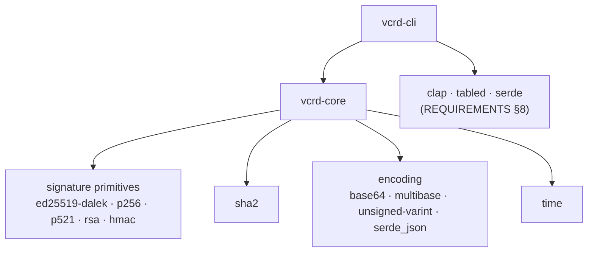
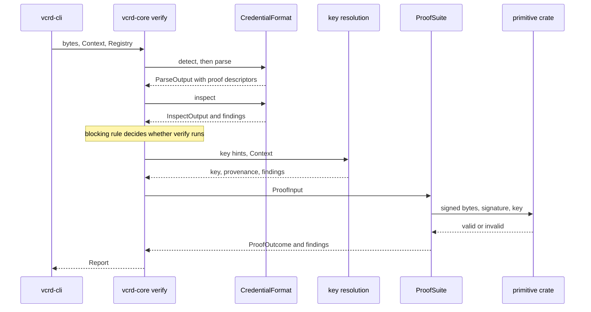

# vcrd Architecture

## 1. Purpose and boundaries

This document describes how vcrd is built: its crate structure and dependencies, its data
types, its control and data flow, and the reasons for its design decisions.

**[REQUIREMENTS.md](REQUIREMENTS.md) is a prerequisite and is not restated here.** Where a
section implements a requirement, it cites the requirement (e.g. "REQUIREMENTS §4") and
describes only the mechanism.

Four documents divide the work:

- **REQUIREMENTS.md** — what vcrd does and must do. It changes only when vcrd's
  functionality changes, not when its implementation does.
- **This document** — structure, data, flow, and design decisions, together with the open
  and deferred implementation items in §10.
- **DEVELOPMENT-PLAN.md** — the order of the work: milestones, what each delivers, its
  exit criteria, and which §10 items it closes. It says when something is built, not what
  it is, and it is retired once its milestones are done; §10 is the durable list.
- **rustdoc** — code-level detail, kept beside the code so it cannot drift, and published
  on docs.rs (REQUIREMENTS §13).

**Status.** The implementation does not yet exist. Sections therefore state decisions and
the constraints the implementation must satisfy, with evidence from a throwaway prototype.
As code lands, descriptions will cite it. Rust shown here is marked *design sketch* where
it states intended structure rather than quoting code.

**Evidence.** Design decisions were settled or tested by that prototype, whose code and
findings are kept on branch `spike/vc-jwt` under `prototype/`. "Finding *N*" refers to
section *N* of `prototype/PROTOTYPE-FINDINGS.md` on that branch. The prototype used
earlier names for several things decided since: `Stage<T>` for the per-phase outcome,
`Tier` for the phase, `blame` for attribution, and `validate` for the inspect phase.

## 2. Crates, dependencies, and feature gates

The crate split — `vcrd-core` and `vcrd-cli`, with formats and proof suites as
feature-gated modules inside core — is specified in REQUIREMENTS §7, and the dependency
policy in REQUIREMENTS §6. This section records the concrete choices that follow from them.

### Dependency stack



REQUIREMENTS specifies the frontend and tooling dependencies; this document specifies the
ones it does not. `vcrd-core` depends on:

| Role | Crate | Used for |
|---|---|---|
| EdDSA | `ed25519-dalek` | Ed25519 verification |
| ECDSA | `p256`, `p521` | ES256, ES512 |
| RSA | `rsa` | RS256 (PKCS #1 v1.5) |
| MAC | `hmac` | HS256 |
| Digest | `sha2` | SHA-256 and SHA-512 for every algorithm above |
| JWS encoding | `base64` | base64url segments of the compact serialization |
| `did:key` | `multibase`, `unsigned-varint` | multibase decoding and the multicodec key-type prefix |
| JSON | `serde_json` | parsing untrusted input |
| Time | `time` | RFC 3339 timestamps in the validity period |

That set verified all five algorithms end to end in the prototype (finding 5), and its
crates perform all of the hashing and arithmetic; vcrd's own code ends at the call into
each crate's verifier.

**No JOSE library.** REQUIREMENTS §10 has vcrd implement the JWS layer itself, so the
graph contains no JOSE crate: vcrd's own code does algorithm policy, by-name rejection, and
the binding of each algorithm to a key type, then calls the primitives directly
(finding 5).

**Constant-time handling**, which REQUIREMENTS §12 asks to be recorded when a crate is
selected. Verification operates on public data — the message, the signature, and the
public key — so variable-time arithmetic leaks nothing. The one secret is an HS256 key, and
the MAC comparison there is constant-time: `digest`'s `Mac::verify_slice` compares tags
with `subtle`'s `ct_eq` (`digest-0.10.7/src/mac.rs:173`, the version in the prototype's
lockfile). RSA padding checks are also constant-time
(`rsa-0.9.10/src/algorithms/pkcs1v15.rs:143–147`). Audit status is not yet recorded; see
§10 [C1].

### Feature gates

- **One Cargo feature per format and per proof suite in `vcrd-core`** (REQUIREMENTS §7).
- **`std-clock`** provides a system-clock implementation. `vcrd-core` does not enable it by
  default and `vcrd-cli` does, so "core never reads the system clock" (REQUIREMENTS §6)
  holds for core's default build rather than by convention.
- **`vcrd-cli` refuses to build with no format enabled**, through a `compile_error!`. A
  `vcrd` binary that can read no credential cannot do its job, and a build error is a
  better answer than a runtime finding.
- **`vcrd-core` may build with no format enabled.** REQUIREMENTS §7 anticipates format
  implementations shipping from outside this repository, and a consumer that registers its
  own format needs a core built without the in-tree ones.
- **Attribution depends on the registry at runtime, not on Cargo features.** When no format
  matches an input, an empty registry attributes the failure to vcrd or to the environment,
  and a non-empty registry attributes it to the input. The rule holds wherever the formats
  came from. The prototype got this wrong: built with no formats, it blamed the input
  ("Answered as a side effect" in the findings).

Which combinations CI builds is specified in REQUIREMENTS §13.

## 3. Data structures

### Result types

```rust
// Design sketch.
pub fn inspect(bytes: &[u8], ctx: &Context, registry: &Registry) -> Report;
pub fn verify(bytes: &[u8], ctx: &Context, registry: &Registry) -> Report;

pub struct Report {
    pub input: InputSummary,
    pub parse: PhaseOutcome<ParseOutput>,
    pub inspect: PhaseOutcome<InspectOutput>,
    pub verify: PhaseOutcome<VerifyOutput>,
    pub not_evaluated: Vec<NotEvaluated>,
    /// One complete result per credential found inside this one. Empty for a bare
    /// credential; a presentation fills it.
    pub contained: Vec<Report>,
}

pub enum Phase { Parse, Inspect, Verify }

pub enum PhaseOutcome<T> {
    NotRequested,
    NotReached { blocked_by: Phase /* plus reason and responsible findings: REQUIREMENTS §16 item 20 */ },
    Failed { output: T, findings: Vec<Finding> },
    Passed { output: T, findings: Vec<Finding> },
}

pub struct Finding {
    pub code: &'static str,       // stable machine identifier
    pub phase: Phase,
    pub attribution: Attribution,
    pub severity: Severity,
    pub detail: FindingDetail,    // one typed variant per condition; no prose
}

pub enum Attribution { Input, Policy, Vcrd, Environment }
pub enum Severity { Info, Warning, Error }
```

- **Core's entry points return a `Report`, never a `Result`.** A malformed, expired, or
  forged credential is the answer, not an error in vcrd's operation. The only faults that
  are errors — an unreadable file, an invalid flag — arise before core is called, so core
  has no error type for them; the CLI carries them in its output (§6; findings 1, 2).
- **A failed phase carries its output** (REQUIREMENTS §6). Every output type therefore
  represents explicitly anything a phase may not have established before failing — the
  validity period when inspection stops at an unimplemented profile, for example — rather
  than the whole output being discarded. The prototype discarded it (finding 1).
- **Only error-severity findings fail a phase.** Warnings and informational findings ride
  along on a passed phase, and do not affect the exit code (§6).
- **`FindingDetail` and `FormatDetail` are ordinary enums, not `#[non_exhaustive]`.**
  Adding a variant then fails to compile everywhere it is matched, including in
  `vcrd-cli`, and that break is the point: the JSON mapping (§6) is where a new variant
  becomes part of the agent-facing schema, so someone has to decide how it appears.
  `#[non_exhaustive]` has no effect inside the defining crate, so it would silence exactly
  the frontend whose mapping matters, leaving the new variant to fall through a wildcard
  arm and the typed detail REQUIREMENTS §6 requires to vanish at the crate boundary. The
  cost is that adding a variant breaks consumers outside the repository, which before 1.0
  is a `0.(x+1).0` change under REQUIREMENTS §13; the prototype measured the break at two
  irrefutable `let` bindings (finding 1). Whether to revisit this once breaking changes
  become expensive is §10 [Q5]. The attribute still belongs on enumerations whose
  consumers are told to expect unknown values, such as the key-provenance `source` (§8).
- **A contained credential gets its own complete result.** A presentation carries one or
  more credentials, each secured independently by its issuer, so each needs its own three
  phase outcomes, findings, key provenance, and not-evaluated list. A flat list of proof
  results cannot say "holder proof verified, credential 2 of 3 expired, credential 3 in a
  format vcrd does not implement", which is the answer REQUIREMENTS §6 requires. Hence
  `Report.contained`, holding whole `Report`s rather than a reduced summary.
- **Containment is one level deep in practice, and the type is uniform anyway.** VCDM 2.0
  §4.13 puts credentials and enveloped credentials in a presentation's
  `verifiableCredential`, not presentations, and an enveloped presentation is a transport
  wrapper rather than a second level of results; an mdoc device response is one level as
  well. A recursive `Vec<Report>` is still the better type: one shape for every level, so
  the schema mapping (§6) and the renderers have one path rather than two, and a
  consumer parses the same object wherever it appears. The depth the type permits and the
  formats do not need is bounded by a cap in `Limits` (§4), which is needed regardless
  because breadth — a presentation enveloping thousands of credentials — is the real
  exposure.
- **`NotEvaluated { what, why }`** lists the checks REQUIREMENTS §12 requires a result to
  disclose as not performed — revocation status, context resolution, holder binding,
  replay binding, issuer accreditation, schema conformance — each with a reason: requires
  network, no parameters supplied, not implemented, out of scope, or phase not reached.

### Per-phase outputs

- **`ParseOutput`** — the format's identifier, the format-neutral `Document`, a
  `FormatDetail` variant holding what only that format has (JOSE header fields, profile),
  and `contained: Vec<ContainedInput>`: for each credential found inside, its bytes, the
  media type from the `data:` URL as a detection hint, and its location, such as
  `verifiableCredential[1]`. The format hands these back; it does not process them (§4).
- **`InspectOutput`** — the profile and the validity-period status: current, expired, not
  yet valid, unbounded, or unknown.
- **`VerifyOutput`** — one `ProofResult` per proof: suite, declared algorithm, outcome, and
  key provenance (§8). `ProofOutcome` is `Verified { disclosed }`, `Failed`, or
  `NotAttempted`; `disclosed` exists so that selective disclosure is not designed out,
  without any claim that it is sufficient.

### The `Document` projection

A format-neutral view that every frontend renders: a `kind` — credential or presentation
— an identifier, types, contexts, the claims, and the proof descriptors, plus the fields
that belong to one kind: issuer and validity bounds for a credential, `holder` for a
presentation. Claims are flattened to dotted leaf paths
(`credentialSubject.degree.name`), so claim names stay visible while every value is
wrapped for redaction (§7). Which fields count as claims and which as metadata is each
format's decision (REQUIREMENTS §8).

Its known limit: it cannot represent a claim that exists but was withheld under selective
disclosure, which is neither present nor absent (§10 [Q3]).

### Catalogue

| Type | Purpose | Produced by | Invariant |
|---|---|---|---|
| `Report` | the complete result | core entry points | one per invocation; never a `Result` |
| `PhaseOutcome<T>` | one phase's outcome | phase runner (§4) | `NotReached` only after a parse failure or under the blocking rule |
| `Finding` | one condition found | any phase | typed detail, no prose |
| `Document` | format-neutral view | format's parse | every credential-derived value is a `ClaimValue` |
| `ClaimValue` | one claim leaf | format's parse | no plaintext accessor outside core's rendering (§7) |
| `ProofDescriptor` | where a proof is and what it covers | format's parse | carries key hints, never a resolved key |
| `KeyHints` | where key material may be | format's parse | typed; an embedded key is parsed, not kept as raw JSON |
| `KeyProvenance` | where the key used came from | key resolution | reported whether verification succeeds or fails (§8) |
| `ProofInput` | what a suite verifies | phase runner | carries no provenance (§5) |
| `ContainedInput` | a credential found inside another | format's parse | bytes, media-type hint, and location; dispatched by the runner, not the format |
| `Context` | everything injected | frontend | no default clock |
| `Limits` | size, depth, claim-count, containment-depth, and contained-count caps | frontend, via `Context` | applied before the work they bound (§4) |
| `Registry` | available formats and suites | frontend | trait objects (§5) |

### The injected `Context`

One structure carries everything REQUIREMENTS §6 requires to be injected rather than read
from ambient state: the clock, the clock-skew tolerance, the algorithm policy, the key
store, the embedded-key opt-in, the limits, the expected challenge and domain, and the
redaction designations. It is built with a builder that takes the clock positionally,
because the clock has no default. Nine items were comfortable in the prototype, and one
structure is still the right shape as designations and future resolvers are added
("Answered as a side effect" in the findings).

### Typed data, not raw JSON values

REQUIREMENTS §6 requires long-lived structures to hold data a debugger can display. A
`serde_json::Value` object cannot be displayed: the Rust debugger formatters show only its
map's internals, with either backing store ("Answered as a side effect"). So nothing
long-lived holds a JSON object. The prototype's one violation, the embedded key held as a
raw value, becomes a parsed JWK structure. Claim values are scalar leaves by construction,
which display correctly.

## 4. Control and data flow

### `vcrd verify`, end to end



In the prototype the corresponding path was traced to the arithmetic: for ES256 it ends in
`ecdsa::hazmat::verify_prehashed` (`ecdsa-0.16.9/src/hazmat.rs:270`), for Ed25519 in
`curve25519-dalek`'s double-scalar multiplication, called from
`ed25519-dalek-2.2.0/src/verifying.rs:552`.

### The phase runner

- The operation fixes the last phase to run: `inspect` runs parse and inspect, `verify` all
  three. Phases after the last are `NotRequested`.
- A parse failure makes every later requested phase `NotReached { blocked_by: Parse }`.
- When verify is requested, the runner applies REQUIREMENTS §4's blocking rule to
  inspect's error findings. If one shows verification to be impossible or dangerous,
  verify is `NotReached { blocked_by: Inspect, … }`; otherwise verify runs whatever
  inspect concluded.
- Whether a finding blocks is decided in the runner, with the `Context` in hand, not
  fixed per finding code: a credential without a usable issuer identifier is unverifiable
  only if the caller also supplied no key material. The result structure for a block is
  REQUIREMENTS §16 item 20.
- **The runner dispatches contained credentials, and recurses.** For each
  `ContainedInput` a parse produced, the runner applies the containment caps, runs format
  detection over its bytes with the media-type hint from the `data:` URL, and runs the
  same phases on it, appending the result to `Report.contained`. The recursion belongs
  here rather than to any format, because a contained credential's format is chosen by
  its issuer, not by the securing mechanism of the thing that carries it: a JOSE-secured
  presentation may envelope an SD-JWT credential. REQUIREMENTS §10's "presentation
  support rides along with each credential format" holds for the presentation's own
  holder proof, not for what it contains.

### Format detection

Each registered format reports `No`, `Maybe`, or `Yes` for the input, and the most
confident wins. If none matches, parse fails, attributed according to whether the
registry is empty (§2).

### Limits in the parse path

REQUIREMENTS §6 requires a limit to run before the work it bounds. For a compact JWS:

1. The size cap is checked against the encoded input before anything else.
2. The segments are base64url-decoded. Decoding is linear and its output is bounded by the
   size cap, so it may precede the depth check.
3. The depth cap is checked on each decoded JSON segment by a string-aware byte scan,
   before any JSON is parsed.
4. The segments are parsed. `serde_json`'s own fixed nesting limit of 128 remains as a
   second guard.
5. The claim-count cap is applied while flattening claims.
6. Before the runner recurses into contained credentials, the contained-count cap is
   checked against the number the parse returned, and the containment-depth cap against
   the current depth. Each contained input then goes through steps 1 to 5 in its own
   right, so its size and depth are bounded by the same caps.

The prototype parsed both JSON segments before checking depth, so its configurable depth
cap bounded nothing; it also reported the depth of the *encoded* token, which is always 0
("Answered as a side effect").

### Where injected items are consulted

| `Context` item | Consulted by |
|---|---|
| limits | parse |
| clock, clock skew | inspect — the validity period |
| algorithm policy | the proof suite |
| key store, embedded-key opt-in | key resolution |
| expected challenge and domain | verification of presentations (not yet designed) |
| redaction designations | claim rendering (§7) |

Key resolution belongs to neither trait. The format supplies hints and the suite receives
a resolved key; a format that resolved keys would be deciding what to trust (finding 4).

### `vcrd-cli`

1. Parse arguments.
2. Resolve settings under REQUIREMENTS §8's precedence — flag, environment variable,
   configuration file, built-in default — resolving redaction designations per path.
3. Read the input from the file or standard input.
4. Build the `Context`: a system clock unless `--now` is given, the key store from the
   caller's key file, and so on.
5. Call core's `inspect` or `verify`.
6. Map the `Report` to the output schema (§6).
7. Render it as `json`, `text`, or `plain`, and print the stderr warning for any reveal.
8. Compute the exit code (§6) and exit.

A fault in steps 1–3 skips to step 6 with the error slot filled, so the output is still
one JSON document.

### The boundary between the crates

Into core: bytes, a `Context`, and a `Registry`. Out of core: a `Report`, and rendered claim
values together with the record of what was revealed (§7). Nothing that crosses is
serializable, and nothing reveals a claim value without being recorded.

## 5. Extension points

### The two traits

```rust
// Design sketch.
pub trait CredentialFormat {
    fn id(&self) -> FormatId;
    fn detect(&self, bytes: &[u8]) -> Detection;
    fn parse(&self, bytes: &[u8], ctx: &Context) -> PhaseOutcome<ParseOutput>;
    fn inspect(&self, parsed: &ParseOutput, ctx: &Context) -> PhaseOutcome<InspectOutput>;
}

pub trait ProofSuite {
    fn id(&self) -> SuiteId;
    fn verify(&self, input: &ProofInput<'_>, ctx: &Context) -> (ProofOutcome, Vec<Finding>);
}
```

Responsibilities:

- **A format** detects its input, parses it into a `Document` and its `FormatDetail`,
  locates each proof and the key hints for it, hands back any credentials it finds inside
  as `ContainedInput`s, performs inspection, defines which of its fields are claims, and
  supplies the path notation for redaction designations (REQUIREMENTS §16 item 18). It
  never resolves keys, dispatches contained credentials, or decides trust.
- **A suite** applies the algorithm policy, binds the algorithm to the key type, computes
  the bytes the signature covers, and calls the primitives. It never sees key provenance.
- **The phase runner** — neither trait — resolves keys, records provenance, applies the
  blocking rule, and lists what was not evaluated.

### Who computes the signed bytes

The suite. For JOSE the computation is the identity over `header.payload`, which is why
the prototype could have the format do it. For Data Integrity it depends on the
cryptosuite: the W3C *Data Integrity EdDSA Cryptosuites v1.0* Recommendation has
`eddsa-rdfc-2022` canonicalize with RDF Dataset Canonicalization (§3.2.3) and
`eddsa-jcs-2022` with the JSON Canonicalization Scheme (§3.3.3). A format that computed
the bytes would have to dispatch on cryptosuite name (finding 4).

So `ProofInput` must carry what each kind of suite needs — detached bytes for JOSE, the
unsecured document and proof options for Data Integrity — and becomes an enum, on the
same terms as the enums in §3: no `#[non_exhaustive]`, so that adding a kind breaks every
suite that matches on it. The Data Integrity side is open until that path is designed
(§10 [Q1]). `ProofInput` does not carry key provenance, which the prototype passed and no suite
read (finding 4).

### Injected traits

- **`Clock`** — the current time. A system implementation exists behind `std-clock` (§2).
- **`KeyStore`** — caller-supplied key material, by key identifier or as the sole key.
- **Still to come** (REQUIREMENTS §6, §12): a DID resolver, a JSON-LD context loader, an
  HTTPS trust anchor, and a random source for proof generation.

### Dyn compatibility

The registry behind `vcrd formats` and `vcrd suites` holds `Box<dyn CredentialFormat>` and
`Box<dyn ProofSuite>`, so both traits must be dyn-compatible: no generic methods, no
associated constants, no methods returning `Self`. Associated types are permitted, but a
trait object must fix them, which a registry of formats with different output types
cannot do. Hence per-format output is a closed enum (§3). Methods taking
borrowed inputs such as `ProofInput<'a>` are fine. The prototype confirmed all of this by
construction (finding 4).

### Adding a format

1. Add a Cargo feature in `vcrd-core` and a `FormatDetail` variant.
2. Implement `CredentialFormat` and register it.
3. Define which fields are claims, and the path notation for them.
4. Add the canonical example and the required negative fixtures (REQUIREMENTS §11).
5. Review against the format's normative text, with each gap a test seen to fail and then
   to pass (REQUIREMENTS §11).
6. Check the format's terminology against the glossary (REQUIREMENTS §15).
7. Add the feature combination to CI (REQUIREMENTS §13).

### Adding a proof suite

1. Add a Cargo feature and implement `ProofSuite`.
2. Add its algorithms to the algorithm-to-key-type table, with weak-key criteria (§8).
3. Add fixtures for algorithm confusion, an unsupported algorithm, and a policy
   rejection (REQUIREMENTS §11).
4. Steps 5–7 above.

## 6. vcrd command (vcrd-cli) Output

### The envelope

Every invocation emits one JSON document (REQUIREMENTS §9). Its keys, with the
prototype's name where it differs:

**Always present:**

| Key | Content |
|---|---|
| `schema_version` | `0` during initial development (REQUIREMENTS §9) |
| `status` | a one-word summary naming the earliest failed phase — lossy: it cannot express "expired but correctly signed", and consumers should read `phases` |
| `exit_code` | the process exit code, so that stdout alone carries it |
| `reveals` | every path shown in cleartext or hashed (§7); the prototype had a boolean, `unsafe_cleartext` |
| `input` | byte length, nesting depth of the decoded payload, detected format |
| `phases` | per phase: outcome, what blocked it if not reached, finding codes (prototype: `stages`) |
| `proofs` | per proof: suite, declared algorithm, outcome, key provenance — present for failed verification too |
| `findings` | code, phase, attribution, severity, and typed detail |
| `not_evaluated` | what was not checked, and why |
| `contained` | one nested result per credential found inside this one, in the same shape as the enclosing document, each with its own `phases`, `proofs`, `findings` and `not_evaluated`; `[]` for a bare credential |

**Present when applicable:**

| Key | Content |
|---|---|
| `error` | a caller fault: code and message |
| `format` | format identifier, profile, and format-specific header fields |
| `credential` | the `Document` fields for this object — a credential or a presentation, per its `kind` — with claims rendered per §7 |

Whether inapplicable keys are omitted, as in the prototype, or emitted as `null` is open
(§10 [Q2]).

### Mapping

`vcrd-cli` owns one serializable type per schema object, filled from core's types by an
explicit function; `FindingDetail` maps to JSON by one match arm per variant, tagged by a
`type` field. Renaming a field in core therefore breaks the mapping's compilation instead
of silently changing the schema. In the prototype this was 390 lines in one file, and
mechanical (finding 2).

All three renderers — `json`, `text` (tables), and `plain` — consume this same view, so no
format can bypass redaction or show data another lacks. Accessibility conventions are in
REQUIREMENTS §8.

### Exit codes

| Code | Meaning |
|---|---|
| 0 | every requested phase passed |
| 1 | caller fault: unreadable input, invalid flag |
| 2 | parse failed |
| 3 | inspect failed |
| 4 | verify failed |
| 5 | rejected by caller policy |
| 6 | not supported by vcrd |

The rule runs over the error-severity findings of the whole result, the enclosing document
and everything in `contained` together: any attributed to vcrd gives 6; otherwise any
attributed to caller policy gives 5; otherwise the earliest failed phase anywhere in the
result gives 2, 3, or 4 (REQUIREMENTS §8). `status` names that phase. So a presentation
whose holder proof verifies but whose second credential is expired exits 3, and the
per-credential detail is in `contained`. Errors attributed to the environment, such as missing key material,
take the phase's code. `--verbosity 0` prints nothing, leaving the code as the entire
answer, which cannot express partial success.

## 7. Redaction mechanism

REQUIREMENTS §8 specifies the behavior. The mechanism:

```rust
// Design sketch.
pub struct ClaimValue(/* one scalar leaf */);   // no Serialize; Debug prints only the type
```

- **`Debug` is written by hand** to print only the value's type (`<string>`). A derived
  `Debug` would print the value, and so would a derived `Debug` on any structure containing
  one. The prototype's is at `vcrd-core/src/redact.rs:56` on the spike branch.
- **Core exposes no public accessor for a claim's plaintext.** Its one rendering operation
  takes the designations — each path mapped to show, hash, or mask, defaulting to mask —
  and returns the rendered claims together with a record of every path shown or hashed.
  That record is the output's `reveals` key (§6), so a reveal cannot happen without being
  reported. `--unsafe` designates every path as shown.
- This tightens the prototype, where a frontend obtained plaintext by constructing a
  public capability token and set the reveal marker separately, in a different function,
  with nothing requiring the two to agree (finding 3).
- **Everything derived from credential content is a `ClaimValue`**, including values the
  `Document` surfaces as named fields. The prototype held the subject identifier as a plain
  string and printed it in cleartext while masking the identical claim (finding 3).
- A masked value renders as its type; a hashed value as a truncated digest whose
  construction is open (REQUIREMENTS §16 item 18).

**Designations** travel from the flag, environment variable, or configuration file,
resolved per path by `vcrd-cli` (REQUIREMENTS §8), into the `Context`, and from there to
the rendering operation.

**Testing.** A fixture carries a unique canary string in every claim leaf. For each of the
three output formats, a test asserts that by default no canary reaches stdout or stderr,
that with designations exactly the designated canaries do, and that under `--unsafe` all of
them do. The expected sets are computed from the designations, so the test stays correct
as they change. The prototype's only such test covered JSON alone and checked two literal
values (finding 3).

**What the mechanism cannot cover.** Its guarantee is about output channels — `Display`,
`Debug`, and serialization. A debugger reads memory directly: in the prototype, the
subject identifier appeared in cleartext in a CodeLLDB frame view. Core dumps are
likewise outside it.

## 8. Key resolution, provenance, and algorithms

### Resolution

The precedence is REQUIREMENTS §10's. Resolution runs in the phase runner (§4) and records
every source it consults, so that a "no key material" finding can say where it looked. An
embedded key matches independently established key material when their RFC 7638 JWK
thumbprints are equal. The embedded key is parsed into a typed JWK at the parse boundary
(§3).

### `did:key`

The identifier is decoded with multibase (base58btc, prefix `z`), then an unsigned-varint
multicodec prefix names the key type:

| Multicodec | Name | Decoded | Usable |
|---|---|---|---|
| `0xed` | ed25519-pub | yes | yes |
| `0x1200` | p256-pub | yes, compressed SEC1 | yes |
| `0x1201` | p384-pub | named only | no — needs ES384 (§10 [C3]) |
| `0x1202` | p521-pub | yes, compressed SEC1 | yes |
| `0xe7` | secp256k1-pub | named only | no — ES256K undecided (§10 [C3]) |
| `0x1205` | rsa-pub | named only | no |

A codec vcrd can name but not use fails by name and is attributed to vcrd — REQUIREMENTS
§10's by-name principle applied to key types.

### The provenance record

Shown for example test fixture `embedded-jwk.jwt`, where the credential carries an attacker's 
key but names a `did:key` issuer for a different key:

```json
"key_provenance": {
  "source": "issuer_identifier",
  "method": "did:key",
  "thumbprint": "…",
  "credential_key": {
    "location": "header.jwk",
    "thumbprint": "…",
    "matched": false,
    "verifies_signature": true
  }
}
```

`source` is an open enumeration, so consumers must accept values they do not recognize. Its
values and their guarantees:

| `source` | Meaning | What it does *not* establish |
|---|---|---|
| `caller_supplied` | key material the caller passed in | anything beyond the caller's own assertion that it belongs to the issuer |
| `issuer_identifier` | derived from the issuer identifier the credential names; the credential cannot use a different key while naming this issuer | who controls that identifier |
| `credential_embedded` | a key the credential carries about itself, used only because the caller opted in | anything — it is bound to nothing |

`credential_key` is present whenever the credential offered a key: `matched` says whether
it is the key used, and `verifies_signature` whether the signature verifies under it. That
second verification is additional information — it applies the same algorithm policy and
key-type binding, never affects the verdict or the exit code, and is absent when it cannot
be attempted. `matched: false` with `verifies_signature: true` is specific evidence of key
substitution.

| Situation | `source` | `credential_key` |
|---|---|---|
| `did:key` issuer only | `issuer_identifier` | — |
| caller-supplied key set | `caller_supplied` | — |
| embedded key equals the `did:key` | `issuer_identifier` | `matched: true` |
| embedded key differs | `issuer_identifier` | `matched: false`, `verifies_signature: true` |
| embedded only, caller opted in | `credential_embedded` | `matched: true` |
| embedded only, no opt-in | absent | `matched: false`; the refusal is its own finding |

### Algorithms

| Algorithm | Key type | Crate |
|---|---|---|
| EdDSA | OKP, Ed25519 | `ed25519-dalek`, using `verify_strict` |
| ES256 | EC, P-256 | `p256` |
| ES512 | EC, P-521 | `p521` |
| RS256 | RSA | `rsa`, PKCS #1 v1.5 with SHA-256 |
| HS256 | oct | `hmac`, `sha2` |

- **The algorithm is checked, never obeyed.** The header's `alg` resolves only to an
  algorithm the caller's policy permits and the resolved key supports.
- **`none` is always rejected**, and never treated as a policy question.
- **Unsupported and policy-rejected are evaluated independently**, and both are reported
  when both apply (finding 5).
- **The resolved key's type must match the algorithm's.** Otherwise the result is a
  key-type mismatch attributed to the input. This is the defense against algorithm
  confusion: a token HMAC-signed with the issuer's public key is rejected here, not as an
  unsupported algorithm, because HS256 *is* supported (finding 5).

### Weak keys

REQUIREMENTS §10 requires rejecting key material that cannot bind a signature, reported as
its own finding. The criteria, checked at resolution:

| Algorithm | Criterion | Enforced by the crate? |
|---|---|---|
| EdDSA | a small-order public key is weak (`VerifyingKey::is_weak`); `verify_strict` also rejects a small-order signature point | no — vcrd must check (finding 5) |
| ES256, ES512 | the identity point is rejected; P-256 and P-521 have cofactor 1, so no other point has small order | yes — decoding rejects the identity (`elliptic-curve-0.13.8/src/public_key.rs:232`) |
| RS256 | modulus of at least 2048 bits (RFC 7518 §3.3, a MUST); odd exponent of at least 3 | partly — `RsaPublicKey::new` rejects even and out-of-range exponents, but sets no minimum modulus (`rsa-0.9.10/src/key.rs:501–533`) |
| HS256 | key of at least 256 bits (RFC 7518 §3.2, a MUST) | no |

The prototype enforced none of the rows that need vcrd's own check (§10 [S1], [S2]).

## 9. Security traceability

Each threat in REQUIREMENTS §12, plus the output leak REQUIREMENTS §8 addresses, with the
mechanism and its status:

| Threat | Mechanism | Section | Status |
|---|---|---|---|
| false "verified" through algorithm confusion | caller allowlist; `none` always rejected; algorithm bound to key type | §8 | designed; tested in the prototype |
| false "verified" through key substitution | resolution precedence; provenance, including whether the credential's own key verifies | §8 | designed; tested in the prototype except `verifies_signature` |
| false "verified" through a weak key | per-algorithm criteria at resolution; strict verification | §8 | designed; not in the prototype |
| false assurance from checks not performed | `not_evaluated` in every result | §3, §6 | designed; in the prototype |
| verification steered to fetch key material from an attacker-chosen location | the blocking rule stops verify on a dangerous inspect failure | §4 | designed; no case implemented |
| crash or exploit through malformed input | limits before JSON parsing; no panics; no `unsafe` (REQUIREMENTS §6) | §4 | designed; the prototype's limits were misordered |
| resource exhaustion, including RDF canonicalization | structural limits; a canonicalization budget | §4 | partial; canonicalization deferred with Data Integrity |
| JSON-LD context substitution | pinned context cache; an unpinned context reported loudly | — | deferred with Data Integrity |
| leakage of claim values through output | masked by default; every reveal recorded; canary test | §7 | designed |
| network attacks: interception, SSRF, redirects | HTTPS only, resolved-address checks, size and redirect caps (REQUIREMENTS §12) | — | deferred; no network code yet |

## 10. Open and deferred items

The single list of open questions and to-do items about implementation, testing, and
project setup. REQUIREMENTS §16 keeps only open questions about vcrd's functionality; the
items it once held on these subjects are here, and each keeps its old number there,
struck through, pointing at its tag here.

Each item has a permanent tag: a letter for its group and a number within the group. A new
item takes the next number in its group. A closed item is struck through with its
resolution, as in REQUIREMENTS §16, rather than deleted, so that references to it stay
valid.

### [D] When development is far enough along

- **[D1] Replace references to the prototype** with references to the main implementation,
  including every "finding *N*" citation and every file and line on the spike branch.
- **[D2] Check the documented dependencies against the implementation**, in REQUIREMENTS
  and in §2. Where the implementation changed a dependency without changing vcrd's
  functionality, remove it from REQUIREMENTS, and either record it here if the change is
  significant or leave a comment in the code.

### [S] Standards-review gaps carried from the prototype

Each becomes a test observed to fail and then to pass (REQUIREMENTS §11):

- **[S1]** RSA keys shorter than 2048 bits are accepted (RFC 7518 §3.3; §8).
- **[S2]** HS256 keys shorter than 256 bits are accepted (RFC 7518 §3.2; §8).
- **[S3]** `validUntil` earlier than `validFrom` is not rejected (VCDM 2.0 §4.9).
- **[S4]** The form of `issuer` — a URL, or an object whose `id` is a URL — is not checked
  (VCDM 2.0 §4.7).
- **[S5]** An empty `credentialSubject` object is reported as missing (VCDM 2.0 §4.8).
- **[S6]** JWT `iat` and `exp`, the signature's own times, are ignored (VC-JOSE-COSE
  §3.1.3).
- **[S7]** Conflicts between `iss` and `issuer`, `jti` and `id`, and `sub` and
  `credentialSubject.id` are not reported (VC-JOSE-COSE §3.1.3).

### [T] Testing and CI

- **[T1] VC-API test-vector spike** (formerly REQUIREMENTS §16 item 1). When implementing
  JSON-LD with Data Integrity, build two throwaway branches: one that extracts W3C
  VC-API-shaped test vectors and adapts them into direct calls against `vcrd-core`, and one
  with a minimal local VC-API HTTP shim so the official test harness runs unmodified.
  Compare the working code and each branch's delta from `main`, merge the better, and
  discard the other (REQUIREMENTS §11).
- **[T2] Set up `cargo-fuzz` targets** for `vcrd-core`'s untrusted-input parsers, seeded
  from the vendored conformance fixtures (REQUIREMENTS §11; formerly §16 item 2).
- **[T3] Find non-flaky test patterns for `vcrd --version --verbose`-style output**, once
  that feature exists. Naive tests are coupled to the build environment, commit, and
  timestamp (formerly REQUIREMENTS §16 item 4).
- **[T4] Wire up `cargo-semver-checks` in CI** before the 1.0 release (REQUIREMENTS §13;
  formerly §16 item 6).
- **[T5] Set up `cargo-llvm-cov` coverage tracking** with the ratchet policy, not a hard
  gate (REQUIREMENTS §11), and document the policy in `CONTRIBUTING.md` ([P2]; formerly
  REQUIREMENTS §16 item 12).
- **[T6] Derive structural-limit defaults from a real corpus** (REQUIREMENTS §6). The
  measuring tool exists in the prototype (`vcrd measure`); what is missing is a corpus of
  credentials nobody on this project wrote. Hand-authored fixtures understate realistic
  sizes, and SD-JWT disclosure arrays and JSON-LD contexts will change both size and
  depth (formerly REQUIREMENTS §16 item 19).
- **[T7] Decide the differential-testing harness mechanics** — a dedicated workspace
  crate, ad hoc scripts, or a separate CI job (REQUIREMENTS §11, which referred to this as
  an open item without a §16 entry).

### [Q] Design questions

- **[Q1] The format and suite boundary for Data Integrity** — what `ProofInput` carries for
  a suite that computes its own signed bytes (§5; finding 4).
- **[Q2] Absent keys in the JSON envelope** — omitted, or emitted as `null` (§6;
  finding 2).
- **[Q3] Withheld claims** — how the `Document` represents a claim that exists but was not
  disclosed (§3).
- **[Q4] RSA maximum key size** — the crate rejects moduli over 4096 bits by default; decide
  whether to raise that (§8).
- **[Q5] Revisit `#[non_exhaustive]` before 1.0.** §3 leaves the result enums exhaustive so
  that a new variant breaks the JSON mapping and forces a decision. After 1.0, each new
  variant becomes a major-version change for consumers outside the repository, and this
  project expects to add formats, suites, and checks continuously. Two ways out, if the
  cost bites: mark the enums `#[non_exhaustive]` and carry the guarantee in a test that
  asserts every variant maps to a non-wildcard `type`; or have core present each detail as
  a name plus typed fields, with the exhaustive match inside core where the attribute has
  no effect, so no frontend matches per variant at all. The second also removes the
  per-variant arms the mapping costs today (finding 2).
- **[Q6] Typed detail for implementations outside this repository.** A proof suite shipped
  as its own crate — which REQUIREMENTS §5's IP policy contemplates for proprietary code —
  cannot add a variant to core's `FindingDetail`, and the same holds for a format's
  `FormatDetail` if one is ever split out under REQUIREMENTS §7. `Finding.code` already
  lets such an implementation name a condition core does not know, so what is missing is
  only the typed parameters. Building an escape-hatch variant now would add a
  weakly-typed path into the agent-facing schema that nothing in the repository exercises,
  against §7's own reason for keeping formats in-tree. Decide when the first such
  implementation appears, or when a format is actually split into its own crate.

### [C] Crates and algorithm coverage

- **[C1] Record the audit status of each cryptographic dependency.** REQUIREMENTS §6
  requires well-audited crates, and §12 asks for a note at selection wherever constant-time
  handling is undocumented. `p521` is the least mature of the set: the prototype found an
  accessor gated on a feature the crate does not declare, no `Debug` on its verifying key,
  and no RFC 6979 support (finding 5).
- **[C2] Choose the elliptic-curve crate generation.** The prototype used the 0.13 line so
  that `p256` and `p521` share one generation of their common traits; a 0.14 line exists
  and may fix the `p521` issues in [C1].
- **[C3] Extend algorithm coverage.** REQUIREMENTS §10 asks for coverage as broad as
  practical. The prototype verified EdDSA, ES256, ES512, RS256, and HS256; ES384, the PS
  family, and RS384/RS512 remain, and ES256K needs a decision.

### [G] Guides

- **[G1] Write a debugging guide.** REQUIREMENTS §6 requires a documented debugger
  configuration known to work. The prototype's `DEBUGGING.md` is the starting point.

### [P] Project and repository setup

- **[P1] Switch to Conventional Commits and add `CHANGELOG.md`**, before the project is
  discussed with other people (REQUIREMENTS §14; formerly §16 item 5).
- **[P2] Add `CONTRIBUTING.md`, issue and pull-request templates, and
  `CODE_OF_CONDUCT.md`**, at the same milestone as [P1] (REQUIREMENTS §14; formerly §16
  item 7).
- **[P3] Enable GitHub's "require approval for first-time contributor workflows"
  setting.** Early setup, not gated on going public, since it costs nothing while the
  project is solo-maintained (REQUIREMENTS §12; formerly §16 item 8).
- **[P4] Add a `CODEOWNERS` entry for `.github/workflows/*`**, at the same time as [P3]
  (REQUIREMENTS §12; formerly §16 item 9).
- **[P5] Identify a secondary Code of Conduct contact** — someone other than the primary
  maintainer — before actively inviting outside contributors (REQUIREMENTS §14; formerly
  §16 item 11).
